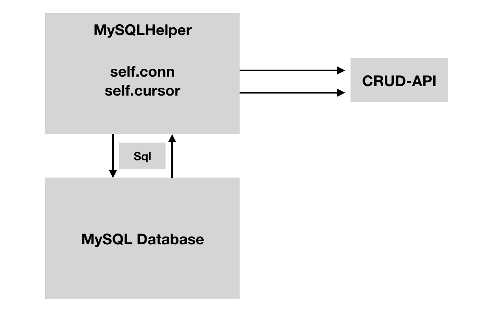

# 本例提供一个数据业务层的简单封装思路

封装思路：

* 提供JDMySQLHelper
* 对内封装 pymysql.connection 与 pymysql.cursor 的操作
* 对外提供 CRUD 的API



---
代码实现：

```
# -*- coding=utf-8 -*-

import pymysql

class JDMySQLHelper(object):

    def __init__(self, host, port, db, user, password, charset):
        self.conn = pymysql.connect(host = host, port = port, db = db, user = user, password = password, charset = charset )
        self.cursor = self.conn.cursor()

    def run(self):
        while True:
            op_code = self.show_menu()
            if op_code == 1:
                self.show_goods()
            elif op_code == 2:
                self.show_brands()
            elif op_code == 3:
                self.show_cates()
            elif op_code == 4:
                self.add_brand()
            elif op_code == 6:
                print('退出')
                break

    @staticmethod
    def show_menu():
        print('1.展示所有商品信息')
        print('2.展示所有品牌信息')
        print('3.展示所有类别信息')
        print('4.添加品牌')
        print('6.退出')
        return int(input('请选择要执行的操作:'))

    def show_goods(self):
        sql = "SELECT * FROM Goods;"
        return self.execute(sql)

    def show_brands(self):
        sql = "SELECT * FROM Good_brand_names"
        return self.execute(sql)

    def show_cates(self):
        sql = "SELECT * FROM Good_cate_names"
        return self.execute(sql)

    def add_brand(self):
        brand = input('请输入一个品牌:')
        sql = "INSERT INTO Good_brand_names VALUES (DEFAULT, %s)"
        self.cursor.execute(sql, [brand]) # 这样可以避免sql注入攻击
        self.conn.commit()

    def execute(self, sql):
        self.cursor.execute(sql)
        records = self.cursor.fetchall()
        print('-' * 10)
        for record in records:
            print(record)
        print('-' * 10)
        return records

    def __del__(self):
        self.cursor.close()
        self.conn.close()

def main():
    helper = JDMySQLHelper(host = 'localhost', port = 3306, db = 'Persons', user = 'root', password = 'zch196511', charset = 'utf8')
    helper.run()

if __name__ == '__main__':
    main()
```