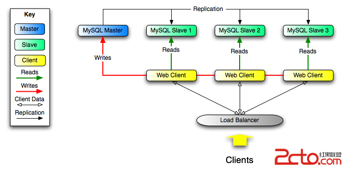
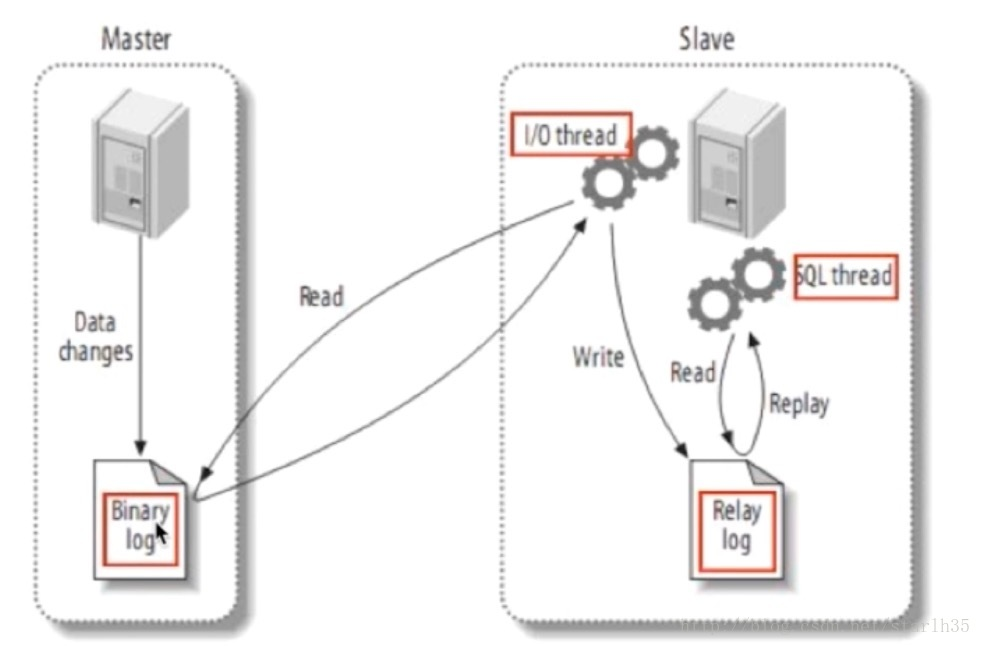

# MySQL 主从数据库

主从数据库的好处：

* 将读操作和写操作分离到不同的数据库上，避免主服务器出现性能瓶颈。
* 主服务器进行写操作时，不影响查询应用服务器的查询性能，降低阻塞，提高并发。
* 数据拥有多个容灾副本，提高数据安全性，同时当主服务器故障时，可立即切换到其他服务器，提高系统可用性。



读写分离的基本原理就是让主数据库处理事务性 增、改、删操作（INSERT、UPDATE、DELETE）操作，而从数据库处理 SELECT 查询操作。数据库复制被用来把事务性操作导致的变更同步到其他从数据库。以 SQL 为例，主库负责写数据。读库负责读数据。每次有写库操作，同步更新到读库。写库就一个，读库可以有多个，采用日志同步的方式实现主库和多个读库的数据同步。



# MySQL 主从数据库配置

* 数据备份，将主服务器数据备份进从服务器
* 配置主从服务器，修改主从服务器配置文件
* 为从服务器创建数据库账户 
* 开启同步

### 数据备份

语法：

备份

```
mysqldump -u 账户 -p 数据库 > 数据库.sql
```

恢复

```
mysql -u 账户 -p 
CREATE DATABASE 数据库;
EXIT;
mysqldump -u 账户 -p 数据库 < 数据库.sql
```

注释：数据库.sql 文件中不包含 CREATE DATABASE 的 SQL 语句，所以从服务器必须先创建好需要备份的数据库。

实例：

备份所有数据库的所有表

```
mysqldump -u root -p --all-databases --lock-all-tables > ~/master_db.sql
```

恢复所有数据库的所有表

```
mysqldump -u root -p < msater_db.sql
```

注释：备份所有数据库时。数据库.sql 文件中包含 CREATE DATABASE 的 SQL 语句，所以从服务器不必先创建好需要备份的数据库。

### 配置主从服务器

我们需要为主从服务器配置不同的 server-id，并且为主服务器配置 log_bin 文件。

操作：

* Mac

```
vim /etc/my.cnf 或者 vim /usr/local/etc/my.cnf
server-id = 1
log-bin = mysql-bin

mysql.server restart
```

* Ubuntu

```
vim /etc/mysql/mysql.conf.d/mysqld.cnf
server-id = 1
log_bin = /var/log/mysql/mysql-bin.log

service mysql restart
```

注释：

* 不同操作系统 MySQL 的安装路径、配置文件路径均不相同。
* server-id 用于标示不同的服务器，具有唯一性，一般使用服务器的 ip 。
* 从服务器无需配置 log_bin 文件。

### 创建数据库账户

语法：

```
GRANT REPLICATION SLAVE ON 数据库 TO '账户'@'访问主机' IDENTIFIED BY '密码';
FLUSH PRIVILEGES;
```

实例：

```
GRANT REPLICATION SLAVE ON *.* TO 'slave'@'%' IDENTIFIED BY 'slave';
FLUSH PRIVILEGES;
```

### 开启同步

语法：

主服务器查看日志文件

```
SHOW MASTER STATUS;
```

从服务器同步到主服务器

```
CHANGE MASTER TO MASTER_HOST = '主服务器ip', MASTER_USER = '账户', MASTER_PASSWORD = '密码', MASTER_LOG_FILE = '主服务器日志文件', MASTER_LOG_POS = '主服务器日志文件';
```

从服务器检测同步

```
SHOW SLAVE STATUS \G;
```

实例：

主服务器查看日志文件

```
mysql -u root -p
SHOW MASTER STATUS;
```

结果集：

| File             | Position | Binlog_Do_DB | Binlog_Ignore_DB | Executed_Gtid_Set |
|------------------|----------|--------------|------------------|-------------------|
| mysql-bin.000001 |      154 |              |                  |                   |

从服务器检测同步

```
mysql -u root -p 
CHANGE MASTER TO MASTER_HOST = '192.168.1.131', MASTER_USER = 'slave', MASTER_PASSWORD = 'slave', MASTER_LOG_FILE = 'mysql-bin.000001', MASTER_LOG_POS = '154';
```

从服务器检测同步

```
mysql -u root -p 
SHOW SLAVE STATUS \G;
```

当看到以下结果时，代表同步成功

```
Slave_IO_Running：Yes
Slave_SQL_Running：Yes
```
