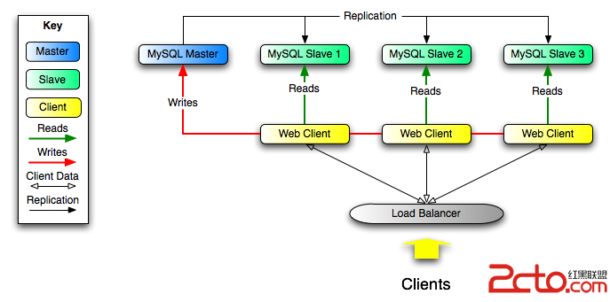
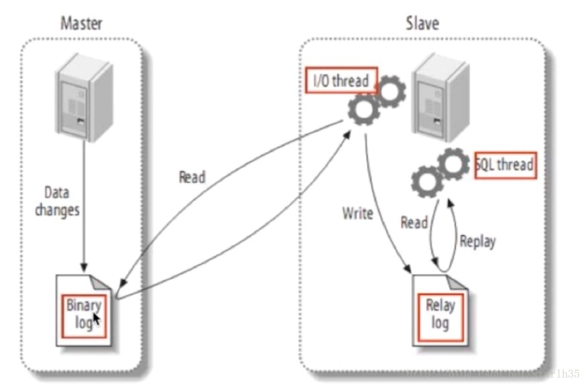

# MySQL 主从数据库

主从数据库的好处：

* 将读操作和写操作分离到不同的数据库上，避免主服务器出现性能瓶颈。
* 主服务器进行写操作时，不影响查询应用服务器的查询性能，降低阻塞，提高并发。
* 数据拥有多个容灾副本，提高数据安全性，同时当主服务器故障时，可立即切换到其他服务器，提高系统可用性。

读写分离的基本原理就是让主数据库处理事务性 增、改、删操作（INSERT、UPDATE、DELETE）操作，而从数据库处理 SELECT 查询操作。数据库复制被用来把事务性操作导致的变更同步到其他从数据库。以 SQL 为例，主库负责写数据。读库负责读数据。每次有写库操作，同步更新到读库。写库就一个，读库可以有多个，采用日志同步的方式实现主库和多个读库的数据同步。

